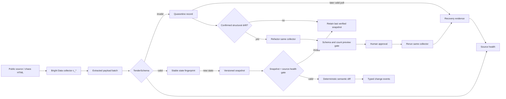

# Architecture

## Data flow

## Boundaries

### Contracts

`packages/contracts` is the canonical boundary. Zod schemas are runtime
validators and the exported TypeScript types are inferred from those schemas,
which prevents a second hand-maintained model from drifting.

The core records are:

- `Tender`: normalized tender state from one source observation.
- `TenderSnapshot`: an immutable, numbered material-state version.
- `TenderChangeEvent`: one or more monitored changes between two snapshots.
- `QuarantinedExtraction`: raw invalid input plus normalized issues and hash.
- `SourceHealth`: current source state and incident linkage.
- `RecoveryEvidence`: what recovery happened and how it was verified.
- `SnapshotSourceHealth`: record-count and absence evidence for a diff.
- `SemanticDiffResult`: the snapshot decision and evidence-backed domain events.

### Validation

`packages/validation` owns deterministic serialization and SHA-256 payload
hashes. It returns a discriminated success/quarantine result and checks that the
payload's `sourceId` matches the collection context.

### Collector worker

`services/collector-worker` contains the in-memory pipeline, an HTTP API, a
one-cycle collection command, explicit mock/live runtime selection, and the
self-healing coordinator. Persistence and scheduling remain replaceable seams.

Snapshots represent material state, not every observation. The fingerprint
therefore excludes `observedAt`; a duplicate poll updates source health without
creating a new snapshot.

The semantic diff engine validates both snapshots before comparison. It rejects
duplicate references, unhealthy collection state, suspicious record-count
collapse, empty-result removals, identity drift, and chronology regressions.
Invalid input returns the previous verified snapshot unchanged. See
`docs/semantic-diff.md` for the fixed thresholds and event vocabulary.

### Provider package

`packages/brightdata` implements bounded Scraper Studio HTTP adapters. Collection
triggers `/dca/trigger` with `queue_next=1`, then polls the returned collection
job. Healing requests a refactor for the same `c_*` collector, preserves the
structured preview, resumes only after approval, and polls terminal status.
Errors are typed and sanitized; tokens remain in authorization headers.

### Local applications

`apps/chaos-source` supplies a stable HTML target whose table layout can become
cards without changing business data, then publish a real amendment. `apps/web`
consumes the typed API and presents the complete judge-visible recovery flow.

## Explicit MVP limits

- State is in memory and resets when the process exits.
- There is no scheduler, durable database, queue, user-account auth, or
  notification delivery.
- The chaos control route and `/api/dev/*` mutations are demo/operator surfaces,
  not a public production control plane. Live mutations have an explicit flag
  and operator-token gate; the chaos control route must remain local/private.
- Automated tests use deterministic providers. A credentialed live Bright Data
  run and saved external evidence are required before claiming the integration
  has been demonstrated against a real account.

These are intentional seams, not hidden production claims.
