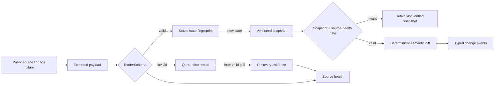

# Architecture

## Data flow

## Boundaries

### Contracts

`packages/contracts` is the canonical boundary. Zod schemas are runtime
validators and the exported TypeScript types are inferred from those schemas,
which prevents a second hand-maintained model from drifting.

The core records are:

- `Tender`: normalized tender state from one source observation.
- `TenderSnapshot`: an immutable, numbered material-state version.
- `TenderChangeEvent`: one or more monitored changes between two snapshots.
- `QuarantinedExtraction`: raw invalid input plus normalized issues and hash.
- `SourceHealth`: current source state and incident linkage.
- `RecoveryEvidence`: what recovery happened and how it was verified.
- `SnapshotSourceHealth`: record-count and absence evidence for a diff.
- `SemanticDiffResult`: the snapshot decision and evidence-backed domain events.

### Validation

`packages/validation` owns deterministic serialization and SHA-256 payload
hashes. It returns a discriminated success/quarantine result and checks that the
payload's `sourceId` matches the collection context.

### Collector worker

`services/collector-worker` is a synchronous reference pipeline with replaceable
in-memory stores. It does not poll, schedule, or make HTTP requests. That keeps
the first implementation deterministic and makes persistence/queue adapters a
later boundary decision.

Snapshots represent material state, not every observation. The fingerprint
therefore excludes `observedAt`; a duplicate poll updates source health without
creating a new snapshot.

The semantic diff engine validates both snapshots before comparison. It rejects
duplicate references, unhealthy collection state, suspicious record-count
collapse, empty-result removals, identity drift, and chronology regressions.
Invalid input returns the previous verified snapshot unchanged. See
`docs/semantic-diff.md` for the fixed thresholds and event vocabulary.

### Provider package

`packages/brightdata` defines a provider-neutral collection interface and a
fail-closed placeholder. It contains no SDK, credentials, or outbound network
code.

### Local applications

`apps/chaos-source` supplies deterministic valid and invalid payloads over local
HTTP. `apps/web` is a compiled dashboard shell proving that browser code can
consume the same typed contracts.

## Explicit MVP limits

- State is in memory and resets when the process exits.
- The chaos source and collector demo are intentionally not connected.
- There is no scheduler, durable database, queue, auth, notification delivery,
  or external collection integration.
- Recovery evidence currently covers the deterministic "next poll becomes
  valid" path. Retry/backoff and alternate-parser strategies are modeled in the
  contract but are not executed.

These are intentional seams, not hidden production claims.
